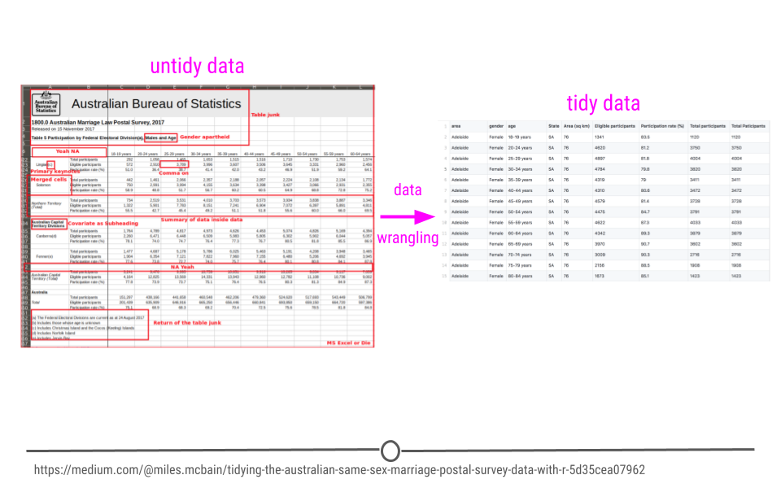

```{r setup, include=FALSE}
options(htmltools.dir.version = FALSE)
knitr::opts_chunk$set(fig.retina = 3, warning = FALSE, message = FALSE)

def.chunk.hook  <- knitr::knit_hooks$get("chunk")
knitr::knit_hooks$set(chunk = function(x, options) {
  x <- def.chunk.hook(x, options)
  ifelse(options$size != "normalsize", paste0("\n \\", options$size,"\n\n", x, "\n\n \\normalsize"), x)
})

# load packages
library(readxl) # this package allows you to read .xlsx files into R
library(haven) # this package allows you to read & write stata .dta files
library(tabulator) # this is a package that is useful for making cross-tabs
library(janitor) # contains useful commands for data cleaning
library(tidycensus) # an R package that allows users to interface with a select
                    # number of the US Census Bureau’s data APIs and return 
                    # tidyverse-ready data frame
library(gapminder) # contains an excerpt of data from Gapminder (https://www.gapminder.org/data/)
library(rvest) # a tidyverse package for webscraping
library(glue) # tidyverse-adjacent package makes working with interpreted string literals simpler
library(lubridate) # tidyverse package for working with dates

library(tidyverse) # this loads the 8 core packages of the tidyverse
library(tidylog) # this is a package that adds extra explanation of tidyverse commands

```


# Welcome

My name is [Nina Brooks](www.ninarbrooks.com) and I am an R enthusiast!

<br>
--
This short course is designed to introduce you to the R programming language and get a sense of its possibilities for your own projects.

<br>
--
By the end of this 2-day course, you will see how to do the following in R:
--

- Load variety of different data types
--

- Prepare data for analysis by creating new variables, reshaping data, & identifying duplicates and missing values
--

- Create summary tables
--

- Run regressions
--

- Create data visualizations
--

- And most importantly, where to find help

.footnote[
*I relied heavily on the materials from [Stat545](https://stat545.com/), [Tidyverse Skills](https://jhudatascience.org/tidyversecourse/wrangle-data.html), [IPUMS PMA Data Analysis Hub](https://tech.popdata.org/pma-data-hub/), add more for creating this workshop

]


---
name: agenda
# Agenda

.pull-left[## Day 1
1. Intro to R

2. Reading in different types of Data

3. Data manipulation with the [tidyverse](https://www.tidyverse.org/)

4. Putting it together (at home practice)

]
--
.pull-right[## Day 2
1. Descriptive statistics & nice looking tables

2. Linear Regression & exporting nice looking tables

3. Data Visualization

4. Putting it together (at home practice)

]

???
I will share these slides as well as all of the data and code used in the 2-day workshop.

I will also toggle between the slides and doing live demo in R

---
name: rintro
layout: true
# R and RStudio

---
## Did you do the pre-workshop setup?
--

- Download and install [R](https://cloud.r-project.org/) or update if you had a previous installation
- Download and install [RStudio](https://www.rstudio.com/) or update if you had a previous installation
- Install the packages sent in the R script: `2022_summer_R_workshop_pkgs.R`

--

## No?
- We won't have time to address R or RStudio installation issues during this workshop
- You can follow along with the slides and my shared screens of my R environment
- Reach out to me afterwards about individual issues, although I can't troubleshoot everyone's individual setup
---

## What is R?
--

R is a system for statistical computation and graphics. It consists of a language plus a run-time environment with graphics, a debugger, access to certain system functions, and the ability to run programs stored in script files.

--

R is **free** and open source, has a large group of users that provide support and develop R packages to augment the functions of base R, can be used to perform statistical analyses of all types, make data visualizations, apply machine learning algorithms, and do web scraping, as well as make slides (like these!), prepare documents, such as academic manuscripts or books, build [websites](www.ninarbrooks.com), create interactive web applications, among many other things!

--

## What is R Studio?

RStudio is an integrated development environment or IDE for using R. You need to install R first to also use RStudio. I highly recommend using RStudio instead of just R because it provides a powerful and user-friendly interface for interacting with R.

???
In fact, I will not even show anything in the base R environment.
---
## Add-on packages

There are many user-written packages (that are well maintained and publicly available) to support the functioning of base R. It is easy to install a package directly in the R console:

```{r install, eval=FALSE}

install.packages("tidyverse", dependencies = TRUE)

```
--

A few comments:
- By including `dependencies = TRUE`, we are being explicit and extra-careful to install any additional packages the target  package, tidyverse in the example above, needs to have around.
- The name of the package must be enclosed in quotes
- `install.packages` not `install.package` (it's plural)
- Package names are case sensitive: `"tidyverse"` is not the same as `"Tidyverse"` or `"tidyVerse"`

---
layout: false
# Further resources
Here are some links if you are interested in reading a bit further

- [How to Use RStudio](https://support.rstudio.com/hc/en-us)

- [Getting Help with R from RStudio](https://support.rstudio.com/hc/en-us/articles/200552336-Getting-Help-with-R)

- [R FAQ](https://cloud.r-project.org/)

- [R Installation and Administration](https://cloud.r-project.org/doc/manuals/r-release/R-admin.html)

---
# Objects & Data Structures

.pull-left[
R has 6 basic data types:
- character: `"a"`, `"R has 6 basic data types."`
- numeric (real or decimal): `2`, `17.5`
- integer: `2L`(the L tells R to store this as an integer)
- logical: `TRUE`, `FALSE`
- complex: `1+4i`
]
--

.pull-right[
R also has different data structures:
- atomic vector
- list
- matrix
- data frame
- factors
]

???
The data frame is going to be the primary type of data structure most of you will be working with. Data frames refer to tabulaur/rectangular/spreadsheet style data. As we'll see a little later today, when you work with the tidyverse, data frames are also stored as "tibbles" - but these operate just like data frames for all intensive purposes.

R has other data structures as well, for example, you can import different types of spatial datasets into R and also text data.

---
# R basics

All R statements where you create objects – “assignments” – have this form:
```{r assignment, eval=FALSE, echo=TRUE}

objectName <- value
```
You should **always** use the `<-` operator when assigning objects in R.

--

For example: 
```{r assignment2,  echo=TRUE}

x  <- 3 * 4
x #<<

example <- "This is a string"
example #<<
```

The highlighted lines of code tells R you want to print out whatever is stored in the object "x" or the object "example".
---

# R Scripts

To make your code reproducible, you should always work from a well-annotated R script. These are saved with the file extension `".R"` For example, `"2022_summer_workshop.R"`. 

--

It is also common to write code in R Markdown documents, which are saved with the file extension `".Rmd"`. For example, `"2022_summer_workshop.Rmd"`. 

--

The big difference between an R script and an Rmd document is that Rmd documents are typically intended to weave together narrative text and code together, whereas R scripts contain only code. You'll see me use both in this workshop.

--

To make a comment in your R code (in either an R script or Rmd document), use the `#` before the text you want to comment. To comment out an entire line of code, put the `#` before the code:
```{r comment, eval = F}

example <- "This is a string" # this line of code demonstrates how to assign a string object

# example2 <- "Hello World." # this entire line is commented out and will not be evaluated

```

---

# Misc important commands
To identify or change your working directory:
```{r getwd, eval=FALSE}
# identify current working directory
getwd()

# change working directory
setwd("~/Users/nib21006/my_research_project") # must be contained in quotes!
```

To remove objects in your environment:
```{r rm, eval = F}
rm(example) # removes the object called "example"

rm(list = ls()) # removes everything in the environment

```

Get help from within R on any command (even without an internet connection!):
```{r help}
?getwd
help(getwd)

```

---

# Workflow
I recommend the following workflow:
- Write code in an R script or Rmd document
    - Annotate it well, so your future self understands what you did and why
    - Pro move: use Git or GitHub for version control (you can easily integrate this with RStudio)
    
- Keep an organized working directory with separate folders for raw data, clean data, output (like figures or tables), and scripts
    - The precise structure will depend a bit on your needs
    
- Save your R script/Rmd document! But no need to save your workspace (R will ask you this when you quit). And definitely **never** save an edited or manipulated version of your raw data
    - The ability to reproduce your clean data is exactly why you have your script(s)!
---
class: center, inverse, middle

# LET'S SEE SOME R!

---
name: read_data
layout: true
# Importing Data into R
---

Data are stored in all sorts of different file formats and structures. We’ll discuss each of these common formats and discuss how to get them into R so you can start working with them!

## Excel files
Microsoft Excel files, which typically have the file extension .xls or .xlsx, store information in a workbook. Excel files can only be viewed in specific pieces of software (like Microsoft Excel), and thus are generally less flexible than many of the other formats of storing data. 

Additionally, Excel has certain defaults that make working with Excel data difficult outside of Excel. For example, Excel has a habit of aggressively changing data types. For example if you type 1/2, to mean 0.5, Excel assumes that this is a date and converts this information to January 2nd.

.footnote[
*Special thanks to [Tidyverse Skills](https://jhudatascience.org/tidyversecourse/wrangle-data.html) for the content in this section.
]
---

Reading Excel spreadsheets  into R is made possible thanks to the `readxl` package. You’ll need to install and load the package in before use.

```{r readxl, eval = F}
# install.packages("readxl")
library(readxl)

```

You will use the function `read_excel()` to read an Excel file into your R Environment. The only required argument of this function is the path to the Excel file on your computer. In the following example, `read_excel()` would look for the file “filename.xlsx” in your **current working directory.** If the file were located somewhere else on your computer, you would have to provide the path to that file

```{r read_excel, eval = F}
# read Excel file into R
excel_df <- read_excel("filename.xlsx")

```
---

## Google Sheets files
Many of you probably work in Google Sheets instead of Excel. While you could download data stored in Google Sheets as an Excel file and then import it into R using the `readxl` package, there's a package that allows you to read in a Google Sheets file directly from the Internet, where it lives: `googlesheets4`!

--

Note that if the data hosted on Google Sheets changes, every time the file is read into R, the most updated version of the file will be utilized. This can be very helpful if you’re collecting data over time; however, it could lead to unexpected changes in results if you’re not aware that the data in the Google Sheet is changing.

```{r googlesheets4}
# install.packages("googlesheets4")
# load package
library(googlesheets4)
```

--

The `googlesheets4` package allows R users to take advantage of the Google Sheets Application Programming Interface (API). Very generally, APIs allow different applications to communicate with one another. In this case, Google has released an API that allows other software to communicate with Google Sheets and retrieve data and information directly from Google Sheets.
---

Every time you start a new session, you need to authenticate the use of the `googlesheets4` package with your Google account. 

```{r googleshets api, eval = F}
gs4_auth() # run this to open the Google API authenticator

```

You can use `googlesheets4` to search through the various Google Sheets in your account using `gs4_find()`. Then, you can use the `read_sheets()` function by typing in the id listed for your Google Sheet of interest when using `gs4_find()`. 
```{r gs4_find, eval = F}
gs4_find()

# read Google Sheet into R with id
read_sheet("2cdw-678dSPLfdID__LIt8eEFZPasdebgIGwHk") # note this is a fake id

```

---

You can also navigate to your own sheets or to other people’s sheets using a URL.
** change the below to have eval = T for final use **
```{r read sheet, eval = F}
# read Google Sheet into R with URL
googlesheet_df <- read_sheet("https://docs.google.com/spreadsheets/d/1FN7VVKzJJyifZFY5POdz_LalGTBYaC4SLB-X9vyDnbY/")

googlesheet_df

```

---

## CSV files
Like Excel Spreadsheets and Google Sheets, Comma-separated values (CSV) files allow us to store tabular data. Note that CSV files have a .csv extension at the end. CSVs are plain-text files. This means that there are no workbooks or metadata making it difficult to open these files. 

--

One of the advantages of CSV files is their simplicity. CSVs are flexible files and are thus the preferred storage method for tabular data for many data scientists.

--

You can read .csv files directly into R using a "base" R command: `read.csv()`. However, we'll use the `tidyverse` version in this workshop, which is `read_csv()` from the `readr` package, which is loaded when you load the `tidyverse`.

```{r tidyverse-load}
# install.packages("tidyverse")
# load package
library(tidyverse)
```

---

To read in a .csv file using the `readr::read_csv()` command is simple. Without any additional steps, it automatically knows that the first row of the file contains the variable names and figures out the "type" of most variables (although not the `day` variable - we'll talk about dates later!)

```{r read_csv}
# read CSV into R
csv_df <- read_csv("./data/weather_data.csv")

# look at the object
# you can you head() or just print the df, if it's a tibble
# it will only print out the first 10 rows anyway!
head(csv_df) 

```
---

If you had a few extra rows of information that you didn't want to import as part of your data frame, you can easily skip those:
```{r read_csv-skip}
# read CSV into R
csv_df <- read_csv("./data/weather_data.csv", skip = 3) # skips the first 3 rows
 
# look at the object
csv_df # see how more rows are printed out when we didn't use the head() command?

```

---

## Text (.txt) files
Sometimes, tab-separated files are saved with the .txt file extension. TXT files can store tabular data, but they can also store simple text. In these cases, you’ll want to use the more generic `read_delim()` function from readr.

```{r read_delim}
# read a TXT file into R
txt_df <- read_delim("./data/HAP0006.txt", delim = ",") # specify the delimiter

# look at the object
head(txt_df)
```

---

## Stata .dta files
You can import Stata .dta files directly into R using the `haven` package. This package also allows you to import SAS or SPSS files. The command within the package you'll use is `read_dta()` (notice the pattern?):
```{r haven}
# install.packages("haven")
library(haven)

dta_df <- read_dta("./data/lead_mortality.dta")

# look at the object
head(dta_df)

```

---

## API Data
We already saw how to use an API to access data stored in Google Sheets. APIs can be used to access many other sources of data as well - and many people have written special packages that allow users of common sources of data to authenticate their credentials and then easily import data into R. I won't go through how to use them all - but will list a few common ones:

- [tidycensus](https://walker-data.com/tidycensus/) is an R package that allows users to interface with a select number of the US Census Bureau’s data APIs and return tidyverse-ready data frames.
- [rdhs](https://cran.r-project.org/web/packages/rdhs/vignettes/client.html) allows users to access, search, download, and load USAID's Demographic and Health Survey data.
- [qualtRics](https://cran.r-project.org/web/packages/qualtRics/vignettes/qualtRics.html) implements the retrieval of survey data using the Qualtrics API and aims to reduce the pre-processing steps needed in analyzing such surveys.


---
layout:true
# Exporting Data
---

R has several native formats for writing R objects. These are both very efficient in terms of space as well.

- .rds files: can store a single R object, such as a data frame
- .Rdata or .Rda files: can store multiple objects (think of it like a list)

--

Rds files:
```{r rds, eval=F}
# saves the object "dta_df" as an Rds file
saveRDS(dta_df, file = "./output/example.rds")

# load an Rds fike
rds_df <- readRDS("./output/example.rds")

```

--
Rdata files:
```{r rdata, eval=F}
# saves all the dataframes as a single Rdata file
save(excel_df, googlesheet_df, csv_df, txt_df, dta_df, 
     file = "./output/all_dfs.Rdata")

# loads the Rdata file
load("./output/all_dfs.Rdat")

```

???
Note that for rds we use "saveRDS" and "readRDS" and the file extension is .rds, but for Rdata, we just use save and load and the file extension is .Rdata - these differences matter! 
---

You can also export data in many formats using the `write` versions of these commands. This can be useful if you're collaborating with people who use different programs.

You need to specify the object name and the file path with the correct file extension, for the file it will be written to.
```{r write, eval=F}
# Write to csv
write_csv(dta_df, file = "./output/example.csv")

# Write to stata
write_dta(csv_df, file = "./output/example.dta")

```

---
layout:false
class: middle, center, inverse
# Questions?

---
layout:true
# Data Wrangling
---

Before we get into "data wrangling" in the Tidyverse, we have to first be sure we know what [tidy data](https://www.jstatsoft.org/article/view/v059i10) are.

--

## Principles of Tidy Data
.footnote[*The tidyverse has a very strong opinion about what "tidy" data is. I agree with most of the principles, but think there are plenty of cases in which people need to work with "untidy" data by the tidyverse definitions.]

1. Each variable you measure should be in one column.

--

2. Each different observation of that variable should be in a different row.

--

3. There should be one table for each “type” of data.

--

4. If you have multiple tables, they should include a column in each spreadsheet (with the same column label!) that allows them to be joined or merged.

???
An example of different types of data could be demographic information about patients, which would be stored in one data frame, and measurements collected from those patients at the doctor (such as height, weight, and BP) in another tidy data frame. Clearly, depending on your research question, you may need to merge these into a single data frame to run a regression of BP on patient demographics.
---
layout:false
# Examples of  "untidy" data

---

# Tidying Process aka Data Wrangling


---

# Example of tidy data

---
# The pipe operator 
Pipes, or `%>%` are a `tidyverse` tool (officially contained in the `magrittr` package) for chaining multiple operations on the same data frame together. They can greatly simplify your code and make your operations more intuitive. I'll introduce them now, and soon you'll see how useful they can be! Note that if you're not using pipes, you'll have to specify a data frame directly as an argument to any commands you use.


```{r pipe}
# head(dta_df) # this is how you specify the data argument 
dta_df %>%
    head()
```

???
When you use the pipe, you start with the name of the df and then chain commands onto that dataframe from the pipe.
---
layout:true
# Basic data frame operations
---

To see how these work, let's use the World Bank [World Development Indicators Data](https://databank.worldbank.org/source/world-development-indicators), which we read into R earlier using `read_excel()`.
```{r wdi, echo = F}
wdi <- read_excel("./data/Data_Extract_From_World_Development_Indicators.xlsx")
```

```{r wdi2}

wdi <- read_excel("./data/Data_Extract_From_World_Development_Indicators.xlsx",
                       n_max = max(which(wdi$`Country Name` == "Zimbabwe")))
head(wdi)

```
???
Talk through what the WDI data contains. All countries, different series, 2010-2021. Explain how it's wide & long - with different years stored as variables and different variables stored in rows -- very untidy data!
---

The opposite of `head` is `tail`:
```{r tail}
tail(wdi)
```
---

`names()` or `ls()` or `colnames()` will all give you the variable names of a dataframe:
```{r names}
names(wdi)

ls(wdi) # not that ls prints them in alphabetical order, while the other 2 print them in the order they appear in the df

colnames(wdi)
```
---

More ways to query basic info on a data frame:
```{r df-query}
ncol(wdi) # number of columns
nrow(wdi) # number of rows
length(wdi) # length when applied to a df also returns # of columns
dim(wdi) # dimensions of the df: rows by columns
```
---

You can get an overview of what's in the data frame using `summary()`:
```{r summary}
summary(wdi)
```
???
Looks like we have some work to do on this data frame! Everything is currently stored as a character.
---

Another way to see what's in a data frame (and other objects) is with the `str()` command:
```{r str}
str(wdi)
```
---

To specify a single variable from a data frame, use the dollar sign `$` operator:
```{r var}
head(wdi$`Country Name`) # note that variable names shouldn't have spaces in them; this is a "bad" variable name

head(wdi$`Series Name`) # that's why they're enclosed in `back ticks`

```

---

## Recap

- You'll mostly be working with data frame and their cousin the tibble

- Use the `tidyverse`!!! This will provide a special type of data frame called a “tibble” that has nice default printing behavior, among other benefits.

- When in doubt, str() something or print something.

- Always understand the basic extent of your data frames: number of rows and columns.

- Understand what variables are in your data.

- Refer to variables by name, e.g., wdi$country_name, not by column number. Your code will be more robust and readable.

---
layout:false
# Data Cleaning Packages

[`dplyr`](https://dplyr.tidyverse.org/) is the workhorse package for data cleaning in the  `tidyverse`. We'll also make a lot of use [`tidyr`](https://tidyr.tidyverse.org/) and [`janitor`](https://cran.r-project.org/web/packages/janitor/vignettes/janitor.html), which is not part of the `tidyverse`.

If you've never installed these before you'll need to install them first before loading using `install.package("janitor")`, for example `dplyr` and `tidyr` are core `tidyverse` packages and will be installed automatically when you run `install.package("tidyverse")`.

Then you need to load them:
```{r load}
library(janitor)
library(tidyverse) # loads all of the core tidyverse packages
```
---
# Cleaning up variable names

`janitor` provides useful tools for cleaning messy data. The main functions we’ll cover from janitor are:

- `clean_names()` - clean names of a data frame
- `tabyl()` - get a helpful summary of a variable (although I like the `tabulator` pacakge for this)
- `get_dupes()` - identify duplicate observations

In R, variable name must start with letter and can contain numbers, letters, underscores ('_') and periods ('.'). Special characters and spaces are not allowed. Tibbles will allow variable names that are not allowed in base R, but it can complicate things to have these. So let's fix this WDI data.

```{r clean_names}
# these are equivalent -- but the first uses the pipe (%>%) syntax
wdi_clean <- wdi %>%
    clean_names()

wdi_clean <- clean_names(wdi)

```
???
You have to assign your new data frame to an object to save this version with clean names.If you use the same name, it will override that object with the new version. 
---
# Cleaning up variable names

Let's see what the variable names look like now:
```{r clean_names2}

head(wdi_clean)

```
???
The default makes variable names lower case and puts an underscore where spaces used to be. You can change these defaults by specifying other available patterns - look up the help file to see what's there. Also notice how the variables that were all numeric now have an x in front of them? 
---
#  dplyr 

Below is a list of the main functions/commands available within `dplyr`. We won't cover all of them in this workshop. I highly recommend reviewing the documentation for [`dplyr`](https://dplyr.tidyverse.org/), which has extensive explanations and examples. The nice thing about `dplyr` functions is they're all very literal -- they do what they say:

- `mutate()` - create a new column or modify an existing column
- `glimpse()` - get an overview of what’s included in dataset (simialr to `str()`)
- `filter()` - filter rows
- `select()` - select, rename, and reorder columns
- `rename()` - rename columns
- `arrange()` - reorder rows
- `group_by()` - group variables
- `summarize()` - summarize information within a dataset
- `left_join()` - combine data across data frame (other types of joins ar also available)
- `tally()` - get overall sum of values of specified column(s) or the number of rows of tibble
- `count()` - get counts of unique values of specified column(s) (shortcut of group_by() and tally())
- `add_count()` - add values of count() as a new column
- `add_tally()` - add value(s) of tally() as a new column
---

layout: true
# Mutate
---

A lot of the data cleaning work you'll do is within the `mutate` function. For example, let's convert the country name variable into a factor and then convert these numeric variables that are being stored as strings into actual numbers. 

Factors are used for storing categorical variables and have a lot of useful properties for plotting as we'll see later. Factors are comprised of two components: the actual values of the data and the possible levels within the factor.  In general, the levels are friendly human-readable character strings, like “male/female” and “control/treated”. But never ever ever forget that, under the hood, R is really storing integer codes 1, 2, 3, etc.

```{r mutate-factor}
wdi <- wdi %>%  # notice how i'm chaining the original wdi df to the clean_names
    clean_names() %>% # which is chained to the mutate 
    mutate(
        country_name = factor(country_name)
    )

str(wdi$country_name)

```

???
Now that country name is a factor, the levels are the names of the countries, but the data underneath those levels are numeric. 
---


```{r mutate-as-numeric}
wdi <- wdi %>%
    mutate(
        x2010_yr2010 = as.numeric(x2010_yr2010)
    )

str(wdi$x2010_yr2010) # numeric
str(wdi$x2011_yr2011) # still a character string

```

We changed the `x2010_yr2010` variable to be numeric, but what about all the other years? It would be inefficient if we had to do these al one-by-one. Luckily, we don't! We can use the `tidyverse` [selection tools](https://dplyr.tidyverse.org/reference/select.html).
---

In this case, to mutate many variables at once, it's easy since they all have the same pattern -- they all start with "x". We'll use `mutate()` with [`across`](https://dplyr.tidyverse.org/reference/across.html), that makes it easy to apply the same operation across multiple columns at once.

```{r mutate-all-as-numeric}
wdi <- wdi %>%
    mutate(across(starts_with("x"), as.numeric)) 

# now all of them are numeric
str(wdi$x2010_yr2010)
str(wdi$x2011_yr2011)
str(wdi$x2021_yr2021)

```
???
Notice the NAs -- this is what R shows when data are missing.
---
layout: true
# Filter
---

When working with a large dataset, you’re often interested in only working with a portion of the data at any one time. For example, this dataset contains data on 217 countries, but what if you wanted to work with data only for India or only for countries in South Asia? To do this, you would want to filter your dataset to only include data that match these criteria.

```{r filter-1}
india <- wdi %>%
    filter(
        country_name == "India"
    )

head(india)

```
---

You can filter based on multiple criteria using the or ("|") operator.
```{r filter-2}
wdi %>% 
# notice this time I didn't assign it to a new object? this won't be saved in the environment, only printed out
    filter(
        country_name == "India" | country_name =="Bangladesh"
    )

```
---

We can also mutate to create a new variable and then filter based on that. Here we'll use the "in" `%in%` function that comes in base R. This code creates a new `LOGICAL` variable that is `TRUE` if the country name is any of those South Asian countries and `FALSE` otherwise.

```{r filter-3}
sa <- wdi %>% 
    # this south asia variable follows the WB classification for South Asian countries
    mutate(
        south_asia = country_name %in% c("Afghanistan", "Bangladesh","Bhutan",
                                        "India", "Maldives", "Nepal", 
                                        "Pakistan", "Sri Lanka")
    ) %>%
    filter(
        south_asia # by default R takes the TRUE cases
    )

```
---

Let's take a look at this new data frame. We can use `dplyr::count()` to give us a quick tally of 
```{r south-asia}

sa %>%
    count(country_name)

```
---
layout: true
# Select
---

`filter()` will subset data frames by row (ie. if you observations meet a certain condition), `select()` is what you use when you want to... select certain columns. You can also use `select()` to reorder columns. For example, maybe we don't want to keep a country name AND a country code variable in this data set (or a series name AND a series code).

Here I'm selecting `country_name`, `series_name`, and all the variables that start with "x" (using that same "selection tool" we saw before).
```{r select-1}
wdi %>%
    select(country_name, series_name, starts_with("x"))

```
---

You can also do the "negative" of select and say you don't want certain variables:
```{r select-2}
wdi %>%
    select(-c(country_code, series_code))
```
---

And combine everything: `mutate()`,  `filter()` & `select()`, chaining all the operations together with `%>%`s:
```{r select-3}
wdi %>% 
    mutate(
        south_asia = country_name %in% c("Afghanistan", "Bangladesh","Bhutan",
                                        "India", "Maldives", "Nepal", 
                                        "Pakistan", "Sri Lanka")
    ) %>%
    filter(
        south_asia # by default R takes the TRUE cases
    ) %>%
    select(country_name, series_name, starts_with("x"))

```
---
layout:false
# Rename

To rename variables in your dataset, you can use the aptly named `rename()` command. The syntax is `new_name = old_name`, which differs from other programs. You can do multiple variables within the same command -- they just need to be separated by a comma.

```{r rename}
wdi %>%
    select(-c(country_code, series_code)) %>%
    rename(
        country = country_name,
        series = series_name
    )

```
---
layout:false
class: middle, center, inverse
# Questions?

---
layout:true
# Reshaping Data  
---

Tidy data generally exist in two forms: wide data and long data. Both types of data are used and needed in data analysis, and fortunately, there are tools that can take you from wide-to-long format and from long-to-wide format (and bath and forth as needed). This is called **reshaping** data and makes it easy to work with any tidy dataset.

--

### Wide Data
Wide data has a column for each variable and a row for each observation. Data are often entered and stored in this manner. 

--

### Long Data
Long data, on the other hand, may have multiple rows for a given unit, such as repeated observations over time or different measurements for the same person (ie., height, weight, blood pressure).
---

The `tidyverse` contains two commands for reshaping data: `pivot_wider()`, which reshapes data from long to wide, and `pivot_longer()`, which reshape data from wide to long.

Before we introduce any more data cleaning tools, we need to reshape this WDI dataset. You may have noticed we're storing years as columns and variables as rows -- which is not ideal for most analysis, but that's how the data are exported from the World Bank Databank.

We'll actually need to `pivot_longer()` and `pivot_wider()` to get this data in the tidy format we want.

.footnote[
*I highly recommend the IPUMS PMA Data Analysis Hub post on [pivoting](https://tech.popdata.org/pma-data-hub/posts/2021-04-15-migration-discovery/).]
---
```{r prep-wdi, echo=F}
wdi <- wdi %>%
    select(-c(country_code, series_code)) %>%
    rename(
        country = country_name,
        series = series_name
    )

```

First, we'll `pivot_longer()` to get the years stored in rows. We're saying to keep `country` and `series` as they are (don't pivot them), and then put each column name into a new column called year and the corresponding value into a new column called value.
```{r pl-1}
wdi %>%
    pivot_longer(
        -c(country, series), 
        names_to = "year",
        values_to = "value") %>%
    head(n = 3)

```
---

But we can do better. We only want the numeric part stored as the year and we don't need it twice. We can use the option `names_pattern` to specify a [regular expression](https://en.wikipedia.org/wiki/Regular_expression) that looks for numbers and we can use the `names_transform` option to convert it to an integer.

```{r pl-2}

wdi_long <- wdi %>% # this time we'll save it as a new object
    pivot_longer(
        -c(country, series), 
        names_to = "year",
        names_pattern = "(\\d+)",
        names_transform = list(year = as.integer),
        values_to = "value") 

wdi_long %>%
    head(n = 3)

```
---

Depending on your end goal, you may want to keep the data in this very long format. But for many purposes, you would want each of the `series` stored as a separate variable. So, let's `pivot_wider()` to do that. We have to specify which variable in the long data set the new variable names come from (`names_from`) and which variable contains the values (`values_from`).

```{r pw-1}

wdi_long %>%
    pivot_wider(
        names_from = "series",
        values_from = "value"
    ) %>%
    clean_names() %>%
    head(n = 3)

```
---

But now we have reintroduced a problem: invalid variable names that contain spaces and symbols. There are a lot of ways you could solve this. I'll use it as a chance to introduce another important `tidyverse` command: `case_when()` and some string operations.

First, I'll create an abbreviated version of the series, and then `pivot_wider()` using this version. To do that, let's look at what series (or variables) are in this data: 
```{r tab}
library(tabulator)

wdi_long %>%
    tab(series)

```
---

Based on those long names, I'll use `case_when()` within a `mutate()` to match certain words and then create a new short version.
```{r case_when}

wdi_long <- wdi_long %>%
    mutate(
        series_short = case_when( # use case_when() for conditional operations
            str_detect(series, "electricity") ~ "electricity",
            str_detect(series, "(?=.*Education)(?=.*female)") ~ "edu_female", #<<
            str_detect(series, "(?=.*Education)(?=.*male)") ~ "edu_male",#<<
            str_detect(series, "GDP per capita") ~ "gdppc",
            str_detect(series, "malaria") ~ "malaria",
            str_detect(series, "Internet") ~ "internet",
            str_detect(series,  "(?=.*Labor)(?=.*female)") ~ "lfp_female",#<<
            str_detect(series, "(?=.*Labor)(?=.*male)") ~ "lfp_male",#<<
            str_detect(series, "Military") ~ "military",
            str_detect(series, "Poverty") ~ "poverty_gap",
            str_detect(series, "Prevalence") ~ "underourished"
        )
    )

```
???
These highlighted lines are a little more complicated - we don't have time to into all the details of regular expressions, but to briefly explain. The main command, str_detect is looking at the original variable series and seeing if the word I put there can be detected. for example, it looks for the word "electricity" and wherever it finds a match, the case_when tells R to "electricity" in the new variable called series_short. The educational attainment and labor force participation cases are more complicated because the data has variables for males and females separately. So we need to use some extra regular expressions to detect if "eduction" & "female" are found together.
---


These new values of the variable `series_short` will work great as variable names when we pivot.
```{r case_when-2, echo = F}

wdi_long %>%
    tab(series, series_short)

```
---

Now that we have this new variable for the series, we can `pivot_wider()` again (and drop the original `series` variable. Now you can see that each row represents a country in a given year and all the variables (electricity access, poverty gap, etc) are stored as columns with the corresponding value.
```{r pw-2}

wdi_long %>%
    select(-series) %>%
    pivot_wider(
        names_from = "series_short",
        values_from = "value"
    ) %>%
    head(n = 3)

```

```{r pw-3, echo=FALSE}

wdi_df <- wdi_long %>%
    select(-series) %>%
    pivot_wider(
        names_from = "series_short",
        values_from = "value"
    )

```
---
layout: true
# Grouping & Summarizing Data
---

You will often want to calculate statistics by groups of variables. For example, in this WDI data we might want to calculate the average poverty gap in every country (and for each year). For operations like this, `group_by()` is a powerful tool!

The `group_by()` function groups a dataset by one or more variables. On it's own it does not appear to change the dataset very much. The difference between the two outputs below is subtle:


An ungrouped data frame:
```{r ungrouped}
head(wdi_df, 3)

```
---

A grouped data frame:
```{r group}
wdi_df %>%
    group_by(country) %>%
    head(3)

```

--

To get summary statistics, you'll need to combine it with a call to `summarise()`.
---

Let’s start with simple counting. How many observations do we have per country? (Hint: you can accomplish the same using `dplyr::tally()`). You can see we have 12 observations per country -- that's because we have a separate row for every year and there are 12 years of data (2010 - 2021).

```{r count}
wdi_df %>%
  group_by(country) %>%
  summarise(n = n())

```
???
R will accept both the British and American spellings.
---

What if we wanted to calculate the mean GDP per capita for each country over the 12 years of data? We can simply add more operations within the call to `summarise()`.

```{r summarise-mean}
wdi_df %>%
  group_by(country) %>%
  summarise(
      n = n(),
      gdp_avg = mean(gdppc))

```
???
Why is everything missing? We'll see how to identify missing data shortly.
---

When calculating many different statistics, you need to be aware of missing data and decide how to handle them. R can't calculate a mean when some of the values are missing unless you tell R to ignore them.

```{r summarise-mean2}
wdi_df %>%
  group_by(country) %>%
  summarise(
      n = n(),
      gdp_avg = mean(gdppc, na.rm = TRUE)) 

```
---

The functions you’ll apply within summarize() include classical statistical summaries, like `mean()`, `median()`, `var()`, `sd()`, `IQR()`, `min()`, and `max()`. `dplyr` also includes short-cuts for working across multiple variables, for example you can use `summarise_at()` the same summary function(s) to multiple variables.  Let’s compute the average and median of GDP per capita and % electricity access by country.

```{r summarise_at}

wdi_df %>%
  group_by(country) %>%
  summarise_at(
      vars(gdppc, electricity),
      list(~mean(., na.rm = TRUE), ~median(., na.rm = TRUE))) 

```
???
Here I specified 2 variables by name, but you can also use the handy selectors in the tidyverse, such as "starts_with" and "ends_with", among others, to efficiently select variables.
---

But note how the data frame that was returned has fewer rows -- 217 or 1 for each country. When you use `summarise()` it changes the structure of your data, if you wanted to calculate the mean GDP per capita for each country and add it as a variable to the original data frame with yearly observations for each country, you would use a `mutate()`.
```{r mutate-mean}
wdi_df %>%
  group_by(country) %>%
  mutate(
      n = n(),
      gdp_avg = mean(gdppc, na.rm = TRUE)) %>%
    select(country, year, gdppc, n, gdp_avg)

```
???
Now notice how the same value of mean GDP we calculated shows up for every observation of Afghanistan. This is the key distinction between summarise and mutate.

---
layout: true
# Identifying duplicates & missing data
---

Identifying duplicates and missing values are two of the most important tasks you'll do when cleaning data. Let's start with duplicates. There are a few different commands you can use to identify duplicates or identify distinct observations.

To see how this works, I created some data with duplicates:

```{r dup-data, echo = FALSE}
df <- tribble(
    ~x, ~y, ~z,
    "a", 2, 5,
    "a", 2, 5,
    "a", 0, 5,
    "b", 3, 9
)

```

```{r dup_data}
df

```
---

`dplyr` contains a command called `distinct()`, which returns rows that contain unique data across all the variables. In this case that leaves us with only one row where `x = a, y = 2, z = 5`. 

The other row where `x = a` is kept because the other variables have different values -- so they're not perfect duplicates.

```{r duplicate}

df %>%
    distinct()

```
---

But before just blindly removing duplicates, you might just want to see where they are. Or maybe you want to get rid of all duplicates of a single variable. You can use a few handy `dplyr` commands for this:
```{r duplicate2}

df %>%
    group_by(x) %>%
    add_tally() # gives you how many observations per value of x

```

---

Or you could check for duplicates across values of multiple variables:

```{r duplicate3}

df %>%
    group_by(x, y) %>% # you can group by as many variables as you want
    add_tally() # gives you how many observations per value of x & y

```

---

Now, let's see how to check for missing values. First, it’s important to note the difference between “NA” and “NaN”. You can use the help function to take a closer look at both values: `?NA`. Briefly, NA” or “Not Available” is used for missing values, while “NaN” or “Not a Number” is used for numeric calculations. If a value is undefined, such as 0/0, “NaN” is the appropriate way to represent this.


To see how this works, I created some data with missing values:

```{r na-data, echo = FALSE}
df <- tribble(
    ~x, ~y, ~z,
    "a", 2, NA,
    "a", 2, 5,
    "a", NaN, 5,
    "b", 3, 9,
    "c", NA, 8
)

```


```{r na_data}
df

```
---

Now let's see how to use `dplyr` functions to identify and filter out missing data along with the base R command `is.na()`. The below code gives us the count of missing (NA or NaN) observations by each variable using the `summarise_all()` function.

```{r find-na}

df %>%
  summarise_all(list(~sum(is.na(.))))

```

---

Or if you wanted to just see which rows of data had missing values, you could use:
```{r filter-na}
df %>% 
  filter(if_any(everything(), is.na))


```
---

Finally, if you wanted to filter to keep only rows with complete you can use `drop_na`.
.pull-left[
```{r pre-data}
# original data
df
```
]

.pull-right[
```{r post-data}
# after dropping all NA
df %>% drop_na

```
]

---

And, to drop rows if they contain NAs only of one variable you can use a filter:
```{r drop1na}
df %>% 
    filter(!is.na(z)) # use ! to negate

```
---
layout: true
# Combining Data
---

Data often arrives in many pieces and it's common to combine data from many different sources. To get all of the data into a single data frame, there are two common tasks:

### Binds
Essentially "smashes" dataframes together. When done in a row-wise way, it's called a row bind (you may have seen this called "appending" somewhere else). You can also do this in a column wise way, which unsurprisingly is called a column bind.

With binds you have to be really careful. For example, when row binding, do the same variables exist in each? Are they of the same type? Different approaches for row binding have different combinations of flexibility vs rigidity around these matters. When column binding, the onus is entirely on the analyst to make sure that the rows are aligned. I would avoid column binding whenever possible.

.footnote[
*This section leans heavily on the tutorials in [Stats545](https://stat545.com/multiple-tibbles.html)
]
---

### Joins
This is often referred to as a *merge*. When joining data, you designate a variable as a "key" and combine data frames by matching observations via the key. This is a much safer way of combining data. `dplyr` contains a multitude of join operations: `left_join()`, `right_join()`, `anti_join()`, `inner_join()`, and `full_join()`.


We'll briefly run through examples of binds and joins.

---

Here is some data on word counts from the Lord of the Rings trilogy:

```{r lotr, echo=FALSE}
fship <- tribble(
                         ~Film,    ~Race, ~Female, ~Male,
  "The Fellowship Of The Ring",    "Elf",    1229,   971,
  "The Fellowship Of The Ring", "Hobbit",      14,  3644,
  "The Fellowship Of The Ring",    "Man",       0,  1995
)

rking <- tribble(
                         ~Film,    ~Race, ~Female, ~Male,
      "The Return Of The King",    "Elf",     183,   510,
      "The Return Of The King", "Hobbit",       2,  2673,
      "The Return Of The King",    "Man",     268,  2459
)

ttow <- tribble(
                         ~Film,    ~Race, ~Female, ~Male,
              "The Two Towers",    "Elf",     331,   513,
              "The Two Towers", "Hobbit",       0,  2463,
              "The Two Towers",    "Man",     401,  3589
)

```

```{r lotr-print}

fship

rking

```

---

Here is some data on word counts from the Lord of the Rings trilogy:

```{r lotr-print2}

ttow

```

---

Because these data all have the same variable names, they are well-suited to binding. For a row bind (stacking them on top of each other), we'll use `bind_rows()`.  Column binding works in a similar way, except you use the aptly named `bind_cols()` command from `dplyr` (or `cbind()` in base R). 
.pull-left[
```{r bind}

lotr <- bind_rows(
    fship, ttow, rking
)

```
]

.pull-right[
```{r bind-print}

lotr

```
]
---

But what if one of the data frames is somehow missing a variable?  Note there is also a base R command that does this, `rbind()`, but it doesn't handle missing data well. Let's do that and see what happens.
.pull-left[
```{r bind2}

ttow_no_Female <- ttow %>% 
    mutate(Female = NULL)

ttow_no_Female

```
]

.pull-right[
```{r bind-print2, error=TRUE}

rbind(fship, ttow_no_Female, rking)

bind_rows(fship, ttow_no_Female, rking)

```
]

--- 


---

Joins are a much more reliable way of combining data. To see how they work, we'll return to the WDI data, with different variables for different countries.

```{r wdi-print, echo=FALSE}

wdi_df %>% head(2)

```

--

What if we had another dataset with other information on countries that we wanted to merge:

```{r data-load, echo=FALSE}

country_df <- read_csv("./data/5a53ccb8-74d0-472a-9424-ff0233d22ef5_Data.csv") %>%
    clean_names() %>%
    select(country_name, series_name, starts_with("x")) %>%
    rename(
        country = country_name,
        series = series_name
    ) %>%
    mutate(
        across(starts_with("x"), as.numeric)) %>%
    pivot_longer(
        -c(country, series), 
        names_to = "year",
        names_pattern = "(\\d+)",
        names_transform = list(year = as.integer),
        values_to = "population") %>%
    select(-series)

write_csv(country_df, path = "./data/country_df.csv")

```

```{r gapminder-print, echo=FALSE}

country_df %>% head(3)

```

---

A `left_join(x, y)` requires you to specify two data frames (`x` and `y`) will keep all the rows that are in `x` and all the matching rows in `y`. But if certain rows of `y` don't exist in `x`, they will not be returned. 

--

For example, this new data frame we have dates back to 1997, whereas the WDI data begins in 2010, so all of those earlier years will not be merged included if the WDI df is specified as the `x` df in a `left_join()`. 

--

Because it's important to keep track of what does and does not merge, I highly recommend the [`tidylog`](https://cran.r-project.org/web/packages/tidylog/readme/README.html) package, which gives you feedback on all `tidyverse` functions, but is especially useful for joins.

--

Let's look at the syntax first, then the output. In this example `wdi_df` is the `x` df, `country_df` is the `y`, and "country" is the key. This variable **must** be in both datasets and if you have multiple variables to match on, you can specify multiple keys.

```{r join}

join_df <- left_join(wdi_df, country_df, by = "country")

```

???
The choice of x and y is yours and depends on your task. The opposite of a left join is a right join - so you can either change the order of x and y or change the join.
---

Now let's see what `tidylog` shows:

```{r join2, message=TRUE}

library(tidylog)
join_df <- left_join(wdi_df, country_df, by = "country")

```

???
Explain all the tidylog output
---

Now, let's look at the output:
```{r join3, echo=FALSE}
join_df

```

???
Explain the year.x and year.y and that's why we have all these extra rows.
---

```{r join4, message=TRUE}

library(tidylog)
join_df <- left_join(wdi_df, country_df, by = c("country", "year"))

```
---

Now, let's look at the output:
```{r join5, echo=FALSE}
join_df %>%
    select(country, year, population, everything())

```

???
Explain how those NAs are there because the population data only contained information up to 2015.

---
layout:false
class: middle, center, inverse
# Questions?
---

# Wrap-up

Today we covered:

- intro to R
- reading data into R
- R basics
- data wrangling with the `tidyverse`

--

There is a companion R script that has all the commands I used today, and a short "assignment" that tests the skills covered in today's workshop. 

--

I'll see you back here tomorrow to get into the "fun" stuff: data visualizations, creating publication ready tables, and the basics of regression analysis.


